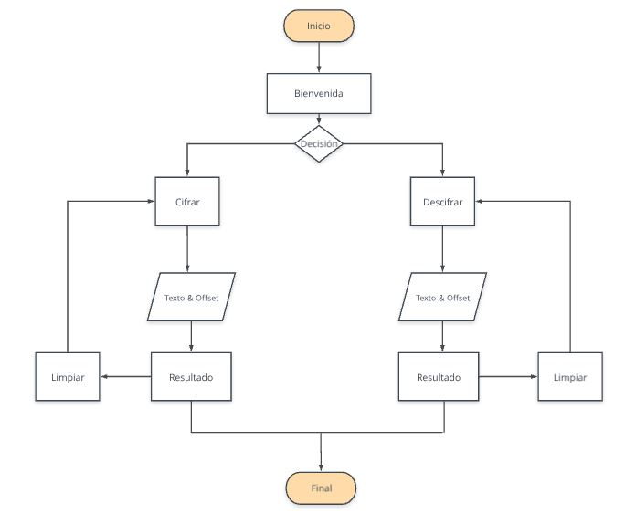

# ANTECEDENTES

Eres de las personas que suele tener la aplicación de notas del celular llena o tener un documento en tu computadora lleno de apuntes y en algunos casos de información que no quieres compartir con nadie.Te preocupa que alguien use tu computadora y lea tus notas personales, tranquilo, esta aplicación web fue creada pensando en ti. 

Ahora puedes cifrar tus ideas, apuntes o lo que quieras y no preocuparte si alguien las encuentra, ya que solo tú puedes saber lo que escribiste. 
O tal vez quieres mantener una conversación privada con alguien, organizar un evento secreto, tranquilo, puedes enviarle el mensaje cifrado a esa persona junto con la clave, que usaste para cifrar, y listo. Ambos podrán comunicarse de manera segura. 😃😄

*** 

# ¿QUÉ CIFRADO USAREMOS?

Usaremos el **cifrado César**.
Cifrar significa codificar. El cifrado César es uno de los primeros métodos de cifrado conocidos. 
El emperador romano Julio César lo usaba para enviar órdenes secretas a sus generales en los campos de batalla.

El cifrado césar es una de las técnicas más simples para cifrar un mensaje. Es un tipo de cifrado por sustitución, es decir que cada letra del texto original es reemplazada por otra que se encuentra un número fijo de posiciones (desplazamiento) más adelante en el mismo alfabeto.

Por ejemplo, si usamos un desplazamiento (offset) de 3 posiciones:

La letra A se cifra como D.
La palabra CASA se cifra como FDVD.
Alfabeto sin cifrar: A B C D E F G H I J K L M N O P Q R S T U V W X Y Z
Alfabeto cifrado: D E F G H I J K L M N O P Q R S T U V W X Y Z A B C
En la actualidad, todos los cifrados de sustitución simple se descifran con mucha facilidad y, aunque en la práctica no ofrecen mucha seguridad en la comunicación por sí mismos; el cifrado César sí puede formar parte de sistemas más complejos de codificación, como el cifrado Vigenère, e incluso tiene aplicación en el sistema ROT13.

***
# OBJETIVOS DE APRENDIZAJE

En este proyecto aprenderás a construir una aplicación web que interactúe con el usuario a través del navegador y la lógica basada en esa interacción. Dicho en palabras sencillas, aprenderás a:

* Pintar elementos de formulario en la pantalla usando HTML y CSS.
* Permitir al usuario interactuar (eventos del DOM) y hacer algo cuando ocurran dichos eventos (cifrar/descifrar).
* Manipular strings (cadenas de texto).
* Usar control de flujo (bucles, condicionales, ...).
* Actualizar la pantalla con los resultados (manipular el DOM).
* Implementar funciones dada una descripción de su comportamiento.
* Verificar tu implementación con pruebas unitarias.
* Entender las necesidades del usuario y cómo proponer una solución.
* Organizar tu tiempo y priorizar tareas en un entorno de alta incertidumbre.

***
# PROCESO - USUARIOS

## ¿Quiénes son los principales usuarios de nuestro producto?

Nuestro público objetivo principal son jóvenes de 18 a 25 años. Jóvenes que se encuentran estudiando y a la par trabajando. En algunos casos son personas independientes, jóvenes que buscan tener algún emprendimiento y tienen algunas ideas sobre lo que quieren hacer. Grupos a los que les gusta mantener la privacidad de sus comunicaciones o ideas.

Algunas características de nuestro público:

* Si bien hay un rango de edades para el público objetivo principal, el uso de la aplicación está abierto a personas de diferentes generaciones. Podrían usarla tanto adolescentes como personas adultas. Por lo que se pensó en una interfaz que tome en consideración todas las necesidades. 

* La interfaz debe ser amigable e intuitiva. Como no todos los usuarios sabrán el funcionamiento de la aplicación web, se incluyó un texto corto y puntual con instrucciones de uso. Se usaron colores amigables y se jerarquizó la información, para hacer más ordenado todo. 

## ¿Cuáles son los objetivos de estos usuarios en relación con tu producto?

Los objetivos de los usuarios en relación al uso de la aplicación web: 

* Poder cifrar ideas, mensajes personales con una clave a elección.
* Poder descifrar mensajes, ingresando la clave proporcionada. 
* Mantener información personal o textos que el usuario considere de manera cifrada.
* Compartir mensajes secretos con otra persona.

## ¿Cómo crees que el producto que estás creando está resolviendo sus problemas?

La creación de esta aplicación web, permitirá al usuario cifrar y descifrar mensajes. Y esto hará que dejen de preocuparse si alguien lee sus apuntes personales de “casualidad”, resguardando así ideas o textos personales. A su vez, podrá descrifrar mensajes que otros usuarios de la aplicación le envíen, teniendo la clave del cifrado, o compartir mensajería secreta con otra persona.

***
# PROCESO - DECISIONES DE DISEÑO

## REALIZACIÓN USER STORIES

1. Como usuario quiero leer sobre el funcionamiento de la aplicación de manera clara.

2. Como usuario quiero poder cifrar mis mensajes y elegir la clave de cifrado.

3. Como usuario quiero poder descifrar mensajes que me envíen usando la clave que me brinden.

4. Como usuario quiero poder ingresar varios mensajes a cifrar o descifrar.

## DIAGRAMA DE FLUJO

## PROTOTIPOS

1. El primer prototipo mostraba solo una pantalla, con el título de la aplicación. Un input de texto para ingresar datos. Se mostraría un cuadro para elegir el offset, además de los botones de cifrar y descifrar. Al darle click a cualquiera de los botones, ya sea cifrar o descifrar, la aplicación lo llevaría a una segunda pantalla, en la cual se mostraría el resultado cifrado o descifrado.

Feedback: 
2. 

