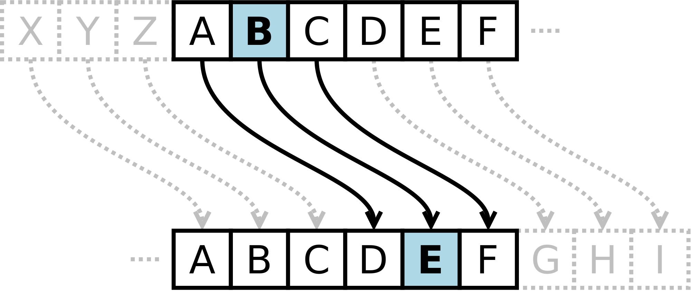

# ANTECEDENTES

Eres de las personas que suele tener la aplicación de notas del celular llena o tener un documento en tu computadora lleno de apuntes y en algunos casos de información que no quieres compartir con nadie.Te preocupa que alguien use tu computadora y lea tus notas, tranquilx, esta aplicación web fue creada pensando en ti. 

Ahora puedes cifrar tus ideas, apuntes o lo que quieras y no preocuparte si alguien las encuentra, ya que solo tú puedes saber lo que escribiste. 
O tal vez quieres mantener una conversación privada con alguien, organizar un evento secreto, tranquilx, puedes enviarle el mensaje cifrado a esa persona junto con la clave, que usaste para cifrar, y listo. Ambos podrán comunicarse de manera segura.

*** 

# ¿QUÉ CIFRADO USAREMOS?

Usaremos el **cifrado César**.
Cifrar significa codificar. El cifrado César es uno de los primeros métodos de cifrado conocidos. El emperador romano Julio César lo usaba para enviar órdenes secretas a sus generales en los campos de batalla.

El cifrado césar es una de las técnicas más simples para cifrar un mensaje. Es un tipo de cifrado por sustitución, es decir que cada letra del texto original es reemplazada por otra que se encuentra un número fijo de posiciones (desplazamiento) más adelante en el mismo alfabeto.

Por ejemplo, si usamos un desplazamiento (offset) de 3 posiciones:

La letra A se cifra como D.
La palabra CASA se cifra como FDVD.
Alfabeto sin cifrar: A B C D E F G H I J K L M N O P Q R S T U V W X Y Z
Alfabeto cifrado: D E F G H I J K L M N O P Q R S T U V W X Y Z A B C
En la actualidad, todos los cifrados de sustitución simple se descifran con mucha facilidad y, aunque en la práctica no ofrecen mucha seguridad en la comunicación por sí mismos; el cifrado César sí puede formar parte de sistemas más complejos de codificación, como el cifrado Vigenère, e incluso tiene aplicación en el sistema ROT13.

***

